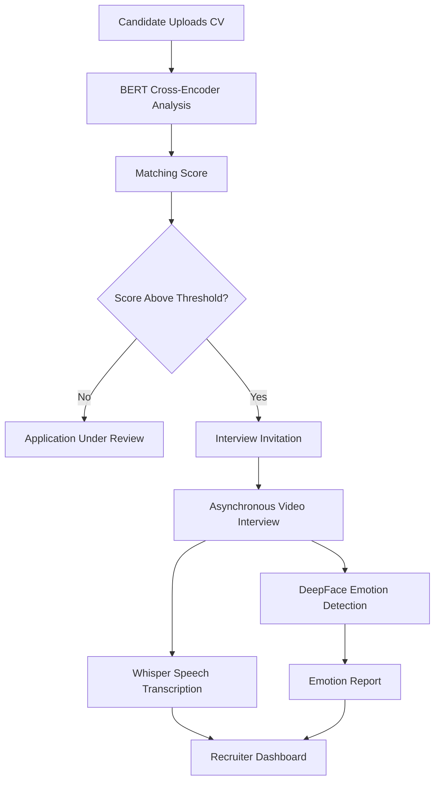
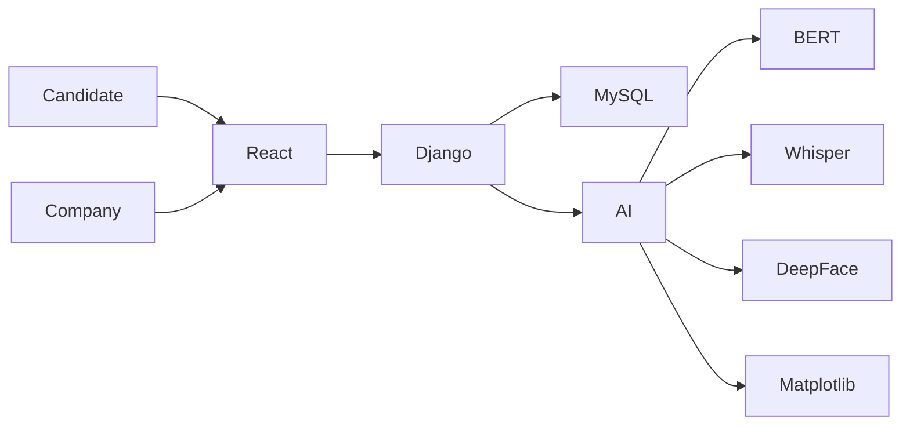

# 🤖 Intelligent Recruitment App

<div align="center">

### AI-Powered Recruitment Platform for Intelligent Candidate Screening & Asynchronous Video Interviews


**An intelligent recruitment platform that leverages Artificial Intelligence to automate candidate screening, evaluate CVs, and conduct asynchronous video interviews.**

</div>

---

# 📖 Overview

**Intelligent Recruitment App** is a web-based recruitment platform designed to improve and accelerate hiring processes using Artificial Intelligence.

The application provides two dedicated user spaces:

* 👤 **Candidates** can browse job offers, submit applications, monitor their application status, and complete asynchronous video interviews.
* 🏢 **Companies** can publish job offers, manage applicants, automatically rank candidates, and analyze interview performance using AI.

The platform integrates several AI technologies to assist recruiters in making faster and more objective hiring decisions.

---

# ✨ Features

## 👤 Candidate

* Secure authentication
* Personal dashboard
* Browse available job offers
* Apply to job offers
* Track application status in real time
* Participate in asynchronous video interviews
* View interview progress

---

## 🏢 Company

* Secure authentication
* Company dashboard
* Create and manage job offers
* View all applications
* AI-powered candidate ranking
* Manage interview stages
* Access interview analytics and emotional reports

---

# 🧠 Artificial Intelligence

## 📄 AI Resume Matching

The platform uses a **BERT Cross-Encoder model** to compare the semantic similarity between a candidate's CV and a job description.

### Features

* Semantic CV analysis
* Job description matching
* Candidate scoring
* Automatic ranking
* Interview recommendation

Candidates with scores above a predefined threshold are automatically promoted to the **Interview** stage.

---

## 🎤 Speech Transcription

Interview recordings are transcribed using **OpenAI Whisper**.

Benefits include:

* Accurate speech-to-text conversion
* Textual interview analysis
* Easier recruiter review

---

## 😊 Facial Emotion Recognition

During video interviews, **DeepFace** analyzes facial expressions to detect emotions.

Supported emotions include:

* Happy 😊
* Neutral 😐
* Sad 😢
* Angry 😠
* Fear 😨
* Surprise 😮
* Disgust 🤢

---

## 📊 Emotional Analytics

Emotion analysis results are visualized using **Matplotlib**.

Recruiters can monitor:

* Emotion distribution
* Emotional trends
* Candidate engagement
* Confidence levels throughout interviews

---

# 🔄 Recruitment Workflow



---

# 🏗️ System Architecture



---

# 💻 Tech Stack

| Category                    | Technologies                                 |
| --------------------------- | -------------------------------------------- |
| **Frontend**                | html, Tailwind CSS                           |
| **Backend**                 | Django, Django REST Framework                |
| **Database**                | MySQL                                        |
| **Authentication**          | JWT                                          |
| **Artificial Intelligence** | BERT Cross-Encoder, OpenAI Whisper, DeepFace |
| **Visualization**           | Matplotlib                                   |

---

# 📂 Project Modules

## Authentication

* User registration
* Login
* JWT authentication
* Role management

---

## Candidate Module

* Dashboard
* Browse job offers
* Submit applications
* Track applications
* Video interviews

---

## Company Module

* Dashboard
* Manage job offers
* Review candidates
* Candidate ranking
* Interview management

---

## AI Module

* CV matching
* Candidate scoring
* Speech transcription
* Emotion detection
* Analytics generation

---

# 📸 Screenshots

Add screenshots inside the **docs/** folder.

```text
docs/
│
├── login.png
├── candidate-dashboard.png
├── company-dashboard.png
├── job-offers.png
├── interview.png
├── reports.png
└── analytics.png
```

---

# 🚀 Installation

## Clone the repository

```bash
git clone https://github.com/your-username/intelligent-recruitment-app.git

cd intelligent-recruitment-app
```

---

## Backend (Django)

```bash
cd backend

python -m venv venv

# Windows
venv\Scripts\activate

# Linux / macOS
source venv/bin/activate

pip install -r requirements.txt

python manage.py migrate

python manage.py runserver
```

---

## Frontend (React)

```bash
cd frontend

npm install

npm run dev
```

---

# 📁 Project Structure

```text
Intelligent-Recruitment-App/

├── backend/
│   ├── authentication/
│   ├── recruitment/
│   ├── interviews/
│   ├── ai/
│   └── manage.py
│
├── frontend/
│   ├── src/
│   ├── components/
│   ├── pages/
│   └── assets/
│
├── docs/
│
└── README.md
```

---

# 🤝 Contributors

This project was developed collaboratively by:      

- BISSI Chaima
- AMANSAG Hasnae
- EL IDRISSI Hafssa
- EL GHOZAIL Khadija
- HOTANY Oumnia

---

# 🌱 Future Improvements

* AI-generated interview feedback
* Recruiter notifications
* Interview scheduling
* Candidate recommendations
* Multilingual support
* Recruiter collaboration
* AI-generated interview questions
* Resume parsing with OCR
* Analytics dashboard enhancements

