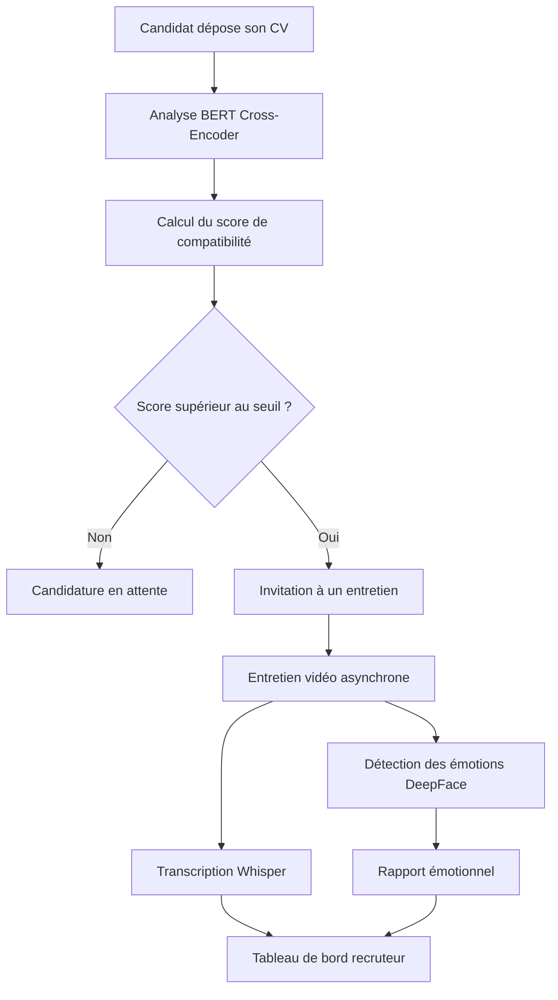
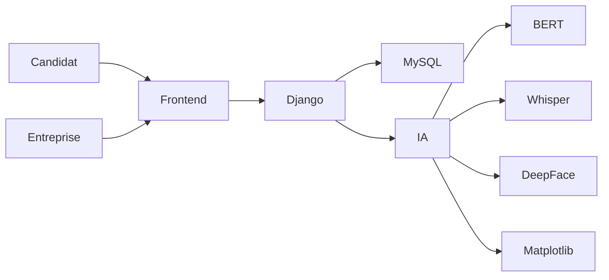

# 🤖 Application de Recrutement Intelligente

### Plateforme de recrutement basée sur l'IA pour le tri intelligent des candidats et les entretiens vidéo asynchrones

**Une plateforme intelligente de recrutement utilisant l'intelligence artificielle pour automatiser l'analyse des CV, la sélection des candidats et les entretiens vidéo asynchrones.**

---

# 📖 Présentation

**Application de Recrutement Intelligente** est une plateforme web destinée à moderniser et accélérer les processus de recrutement grâce à l'intelligence artificielle.

L'application propose deux espaces utilisateurs dédiés :

* 👤 **Les candidats** peuvent consulter les offres d'emploi, envoyer leurs candidatures, suivre leur évolution et réaliser des entretiens vidéo asynchrones.
* 🏢 **Les entreprises** peuvent publier des offres, gérer les candidatures, classer automatiquement les profils et analyser les performances des candidats lors des entretiens.

La plateforme intègre plusieurs technologies d'intelligence artificielle afin d'aider les recruteurs à prendre des décisions plus rapides et basées sur des données.

---

# ✨ Fonctionnalités

## 👤 Espace candidat

* Authentification sécurisée
* Tableau de bord personnel
* Consultation des offres disponibles
* Candidature aux offres d'emploi
* Suivi en temps réel du statut des candidatures
* Participation aux entretiens vidéo asynchrones
* Suivi de l'avancement des entretiens

---

## 🏢 Espace entreprise

* Authentification sécurisée
* Tableau de bord entreprise
* Création et gestion des offres d'emploi
* Consultation des candidatures
* Classement intelligent des candidats grâce à l'IA
* Gestion des étapes du recrutement
* Accès aux analyses et rapports des entretiens

---

# 🧠 Intelligence Artificielle

## 📄 Correspondance CV / Offre d'emploi

La plateforme utilise un modèle **BERT Cross-Encoder** afin de mesurer la similarité sémantique entre le CV d'un candidat et la description d'un poste.

### Fonctionnalités

* Analyse sémantique des CV
* Comparaison avec les descriptions de postes
* Attribution d'un score de compatibilité
* Classement automatique des candidats
* Recommandation pour un entretien

Les candidats dépassant un seuil de compatibilité prédéfini sont automatiquement orientés vers l'étape **Entretien**.

---

## 🎤 Transcription vocale

Les enregistrements vidéo des entretiens sont transcrits grâce à **OpenAI Whisper**.

Avantages :

* Conversion précise de la parole en texte
* Analyse textuelle des réponses
* Facilitation de l'évaluation par les recruteurs

---

## 😊 Reconnaissance des émotions faciales

Pendant les entretiens vidéo, **DeepFace** analyse les expressions faciales afin d'identifier les émotions du candidat.

Émotions détectées :

* Heureux 😊
* Neutre 😐
* Triste 😢
* Colère 😠
* Peur 😨
* Surprise 😮
* Dégoût 🤢

---

## 📊 Analyse émotionnelle

Les résultats de l'analyse faciale sont représentés graphiquement avec **Matplotlib**.

Les recruteurs peuvent consulter :

* La distribution des émotions
* L'évolution émotionnelle pendant l'entretien
* Le niveau d'engagement du candidat
* Les variations de confiance durant l'interview

---

# 🔄 Processus de recrutement

---

# 🏗️ Architecture du système

---

# 💻 Technologies utilisées

| Catégorie | Technologies |
|-----------|--------------|
| **Frontend** | HTML, Tailwind CSS |
| **Backend** | Django, Django REST Framework |
| **Base de données** | MySQL |
| **Authentification** | JWT |
| **Intelligence Artificielle** | BERT Cross-Encoder, OpenAI Whisper, DeepFace |
| **Visualisation** | Matplotlib |

---

# 📂 Modules du projet

## 🔐 Module Authentification

* Création de comptes utilisateurs
* Connexion sécurisée
* Authentification JWT
* Gestion des rôles utilisateurs

---

## 👤 Module Candidat

* Tableau de bord
* Consultation des offres
* Envoi des candidatures
* Suivi des candidatures
* Entretiens vidéo

---

## 🏢 Module Entreprise

* Tableau de bord
* Gestion des offres d'emploi
* Consultation des candidats
* Classement automatique
* Gestion des entretiens

---

## 🤖 Module Intelligence Artificielle

* Analyse CV / offre
* Calcul du score candidat
* Transcription audio
* Détection des émotions
* Génération des rapports analytiques

---

# 🤝 Contributeurs

Ce projet a été développé en collaboration par :

- BISSI Chaima
- AMANSAG Hasnae
- EL IDRISSI Hafssa
- EL GHOZAIL Khadija
- HOTANY Oumnia

---

# 🌱 Améliorations futures

* Génération automatique de feedbacks d'entretien par IA
* Notifications pour les recruteurs et candidats
* Planification automatique des entretiens
* Système de recommandation de candidats
* Support multilingue
* Collaboration entre recruteurs
* Génération automatique de questions d'entretien
* Extraction intelligente des informations des CV avec OCR
* Amélioration du tableau de bord analytique

---
